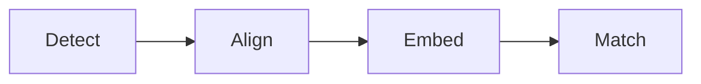
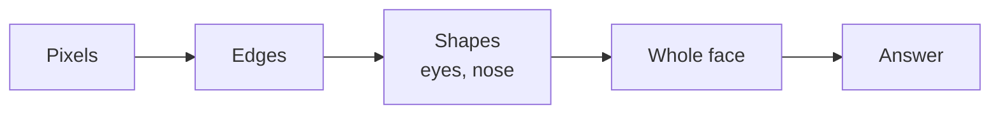
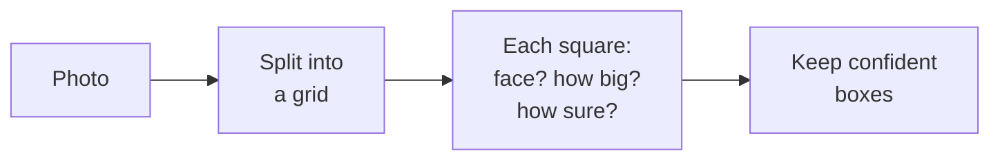
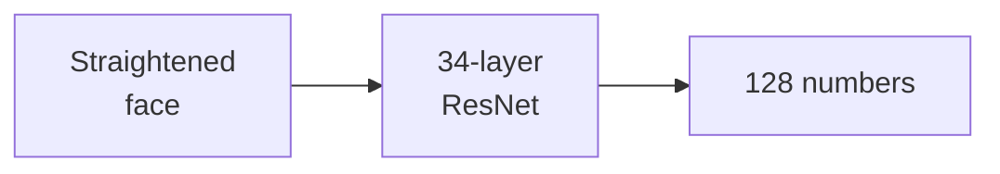
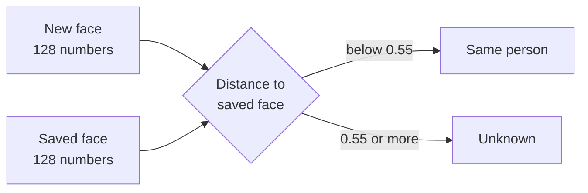

# Visage

**Face recognition that runs entirely in your web browser.**

Visage learns a person's face from a webcam or a photo, then recognises and names them whenever they appear again. All of the work happens on your own device: no photo is ever uploaded, and there is nothing to install.

**▶ Live demo: [veerdodhia.github.io/visage-face-recognition](https://veerdodhia.github.io/visage-face-recognition/)**

*Veer Dodhia · BBA · S.K. Somaiya · Final-year project, 2026*


---

## What it does

- **Learns a face.** You show it a person once and type their name.
- **Recognises that person later,** live on the webcam or in any photo, even a different one.
- **Keeps everything private.** It runs on your computer and saves no photos.

It is designed for places that need to recognise people, such as attendance registers, office entry, identity checks and visitor desks.

---

## Using it, step by step

### 1. Start the camera or upload a photo

Open the live demo and click **Start camera**. If there is no webcam, click **Recognise in a photo** instead. Any face Visage doesn't know yet appears with an orange **Unknown** box.


### 2. Enrol a person and see them recognised

Type a name and click **Enrol from camera**. Visage saves that face, and the box turns blue with the person's name and a match percentage.

The **Under the hood** panel below the camera shows how close the face is to the saved one, and whether that is close enough to count as a match.


### 3. Recognise the same person in a different photo

Upload another photo of someone you have enrolled. Here, Veer was enrolled from one photo and correctly recognised in a completely different one.


---

## How it works

Every face goes through four steps. The first three are AI models that were already trained on millions of faces. The last step is simple maths.



| Step | What happens |
|---|---|
| **Detect** | Finds where each face is in the picture. |
| **Align** | Marks 68 points on the eyes, nose and mouth, and straightens the face. |
| **Embed** | Turns the face into a list of 128 numbers that describes it, like a fingerprint. |
| **Match** | Compares those numbers with each saved face. If the difference is small enough (below 0.55), it is the same person. |

The **Match threshold** slider on the page changes that 0.55 limit. Lower is stricter, and higher is more forgiving.

---

## The AI behind it

Visage uses **four pre-trained neural networks** from the open-source library [face-api.js](https://github.com/justadudewhohacks/face-api.js). They run in the browser through **TensorFlow.js**, which uses the computer's graphics card (via WebGL) to do the maths quickly. Visage does not train anything. It uses models that have already learned from millions of faces.

### What is a neural network?

A neural network is a set of mathematical layers. A picture goes in as numbers (the colour of each pixel). Each layer transforms those numbers, and the network was trained on many examples until its final output became useful, such as "there is a face here".

The networks used here are **convolutional neural networks (CNNs)**, the standard type for images. Each layer slides small filters across the image to detect patterns. Early layers pick up edges, middle layers pick up shapes such as eyes, and the last layers recognise whole faces.



### The four models

| Model | Job | Size | Output |
|---|---|---|---|
| **Tiny Face Detector** | Find faces | 190 KB | A box around each face |
| **68-Point Landmark Net** | Find facial features | 80 KB | 68 points on the face |
| **Face Recognition Net** | Describe the face | 6.4 MB | 128 numbers |
| **Expression Net** | Read the expression | 330 KB | Happy, neutral, sad and so on |

### 1. Tiny Face Detector: finding faces

A small, fast CNN, based on a well-known design called **YOLO** ("You Only Look Once"). It looks at the whole picture in a single pass instead of scanning it piece by piece, which is why it is fast enough for live video.

It divides the picture into a grid. For each square, it predicts whether a face is centred there, how big the face is, and how confident it is. Boxes below 50% confidence are thrown away, and overlapping boxes around the same face are merged into one.



The picture is shrunk before detection, and the size matters. A face that is small in the photo can disappear when the picture is shrunk too much. So Visage checks photos at two sizes (608 and 320 pixels) and combines the results, which catches both far-away and close-up faces.

### 2. Landmark Net: finding the features

A second small CNN looks only at the face box and places **68 points**: 17 along the jaw, 10 on the eyebrows, 9 on the nose, 12 around the eyes and 20 around the mouth. Visage uses these points to rotate and crop the face so the eyes are level. This matters because the next model works best when every face is presented in the same position.

Tick **Show landmarks** on the demo to see the 68 points.

### 3. Face Recognition Net: describing the face

This is the core of face recognition. It is a deep CNN with a **ResNet-34** design: 34 layers, with "shortcut" connections that let information skip layers so a network this deep can still be trained. It takes the straightened face (150 × 150 pixels) and outputs **128 numbers**, called a **face descriptor**.



It was trained with **metric learning**. It was shown millions of face images and adjusted until two photos of the *same* person produced similar numbers, and photos of *different* people produced very different numbers. It was never taught specific people. It learned a general way to describe any face.

The model comes from the dlib library, where its authors report **99.38% accuracy** on the standard LFW face benchmark.

The 128 numbers are not a picture. Nobody can rebuild a face from them, which is why saving them is safe.

### 4. Matching: simple maths, no AI

To decide who a face is, Visage measures the **Euclidean distance** between two sets of 128 numbers, which is the straight-line distance between two points:

```
distance = √[ (a₁ − b₁)² + (a₂ − b₂)² + … + (a₁₂₈ − b₁₂₈)² ]
```



In practice, the same person usually measures between 0.3 and 0.5, and different people between 0.6 and 0.9. The percentage shown on screen is simply `1 − distance`.

### 5. Expression Net

A small extra CNN that classifies the face as neutral, happy, sad, angry, surprised, fearful or disgusted. It is shown on the box for interest, but it plays no part in recognising who the person is.

---

## Privacy

- The AI models run inside your browser, on your own computer.
- No photo is sent anywhere. There is no server.
- Only the 128 numbers are saved, and they cannot be turned back into a photo. Click **Remove** to delete a person.

---

## Run it yourself

**The easiest way** is the live link: [veerdodhia.github.io/visage-face-recognition](https://veerdodhia.github.io/visage-face-recognition/)

**To run it on your own computer:**

1. Click the green **Code** button on this page, then **Download ZIP**, and unzip it.
2. Open the folder in **VS Code**.
3. Install the **Live Server** extension. Open the Extensions tab and search for "Live Server".
4. Right-click `index.html` and choose **Open with Live Server**.
5. Allow camera access when the browser asks.

Don't open `index.html` by double-clicking it. Browsers block the camera on files opened that way.

---

## Project files

| File or folder | What it is |
|---|---|
| `index.html` | The web page and its layout |
| `styles.css` | Colours, fonts and styling |
| `app.js` | Connects the buttons to the recognition engine and shows the results |
| `engine/face-engine.js` | The recognition logic: the four steps, and remembering people |
| `vendor/face-api.min.js` | face-api.js, the open-source AI library |
| `models/` | The trained AI models, about 7 MB |
| `screenshots/` | Images used in this README |

**Built with:** HTML, CSS, JavaScript, face-api.js and TensorFlow.js. Hosted on GitHub Pages.

---

## Limitations

- It cannot tell a real face from a printed photo of that face.
- Poor lighting, masks or sunglasses can lead to "Unknown".
- Very small or turned-away faces may be missed.
- Look-alikes, such as twins, may be confused.
