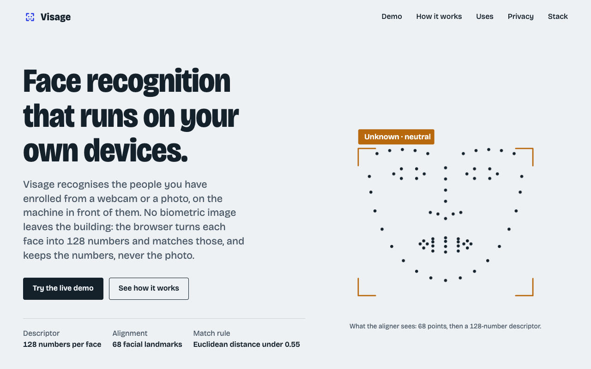
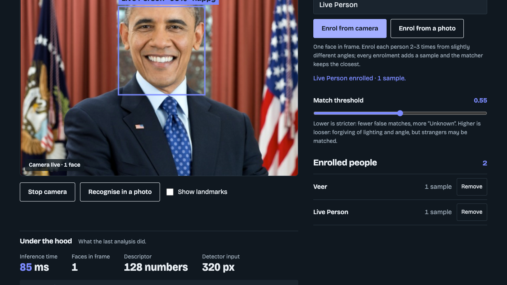
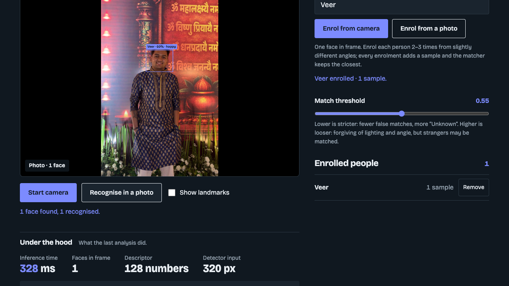
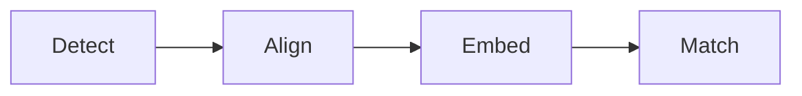

# Visage

**Face recognition that runs entirely in your web browser.**

Visage learns a person's face from a webcam or a photo, then recognises and names them whenever they appear again. All of the work happens on your own device: no photo is ever uploaded, and there is nothing to install.

**▶ Live demo: [veerdodhia.github.io/visage-face-recognition](https://veerdodhia.github.io/visage-face-recognition/)**

*Veer Dodhia · BBA · S.K. Somaiya · Final-year project, 2026*

---

## What it does

- **Learns a face.** You show it a person once and type their name.
- **Recognises that person later,** live on the webcam or in any photo, even a different one.
- **Keeps everything private.** It runs on your computer and saves no photos.

It is designed for places that need to recognise people, such as attendance registers, office entry, identity checks and visitor desks.

---

## Using it, step by step

### 1. Start the camera or upload a photo

Open the live demo and click **Start camera**. If there is no webcam, click **Recognise in a photo** instead. Any face Visage doesn't know yet appears with an orange **Unknown** box.

### 2. Enrol a person and see them recognised

Type a name and click **Enrol from camera**. Visage saves that face, and the box turns blue with the person's name and a match percentage.

The **Under the hood** panel below the camera shows how close the face is to the saved one, and whether that is close enough to count as a match.

### 3. Recognise the same person in a different photo

Upload another photo of someone you have enrolled. Here, Veer was enrolled from one photo and correctly recognised in a completely different one.

---

## How it works

Every face goes through four steps. The first three are AI models that were already trained on millions of faces. The last step is simple maths.

| Step | What happens |
|---|---|
| **Detect** | Finds where each face is in the picture. |
| **Align** | Marks 68 points on the eyes, nose and mouth, and straightens the face. |
| **Embed** | Turns the face into a list of 128 numbers that describes it, like a fingerprint. |
| **Match** | Compares those numbers with each saved face. If the difference is small enough (below 0.55), it is the same person. |

The **Match threshold** slider on the page changes that 0.55 limit. Lower is stricter, and higher is more forgiving.

---

## Privacy

- The AI models run inside your browser, on your own computer.
- No photo is sent anywhere. There is no server.
- Only the 128 numbers are saved, and they cannot be turned back into a photo. Click **Remove** to delete a person.

---

## Run it yourself

**The easiest way** is the live link: [veerdodhia.github.io/visage-face-recognition](https://veerdodhia.github.io/visage-face-recognition/)

**To run it on your own computer:**

1. Click the green **Code** button on this page, then **Download ZIP**, and unzip it.
2. Open the folder in **VS Code**.
3. Install the **Live Server** extension. Open the Extensions tab and search for "Live Server".
4. Right-click `index.html` and choose **Open with Live Server**.
5. Allow camera access when the browser asks.

Don't open `index.html` by double-clicking it. Browsers block the camera on files opened that way.

---

## Project files

| File or folder | What it is |
|---|---|
| `index.html` | The web page and its layout |
| `styles.css` | Colours, fonts and styling |
| `app.js` | Connects the buttons to the recognition engine and shows the results |
| `engine/face-engine.js` | The recognition logic: the four steps, and remembering people |
| `vendor/face-api.min.js` | face-api.js, the open-source AI library |
| `models/` | The trained AI models, about 7 MB |
| `screenshots/` | Images used in this README |

**Built with:** HTML, CSS, JavaScript, face-api.js and TensorFlow.js. Hosted on GitHub Pages.

---

## Limitations

- It cannot tell a real face from a printed photo of that face.
- Poor lighting, masks or sunglasses can lead to "Unknown".
- Very small or turned-away faces may be missed.
- Look-alikes, such as twins, may be confused.
